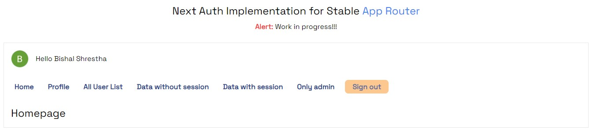

# NEXT AUTH IMPLEMENTATION
## For Stable App Router

## How to?

### For live demo visit [NEXT AUTH HOMEPAGE](https://next-auth-implementation-phi.vercel.app//) deployed in Vercel

### For local hosting
1. Visit my repository at github [here](https://github.com/iambstha/next-auth-implementation)
2. Clone the repository in your local drive
3. Open command prompt & navigate to the project directory
4. Create `.env` file
5. Paste everything from `env.txt` in `.env` file. Make sure to replace the required values.
4. Run `npm run dev`
5. If any issue with tailwind or any node modules occur, please `npm install` in your command prompt
6. Open `http://localhost:3000/` in your browser; chrome or brave is preferred, since there is webkit audio controller in the application, not every browser supports the controller.

| Music Sansar | Deployment   | Link     |
| :---:        |    :----:    |    :---: |
| Live         | Vercel      | [NEXT AUTH HOMEPAGE](https://next-auth-implementation-phi.vercel.app//)   |
| Localhost    | Locally      | `http://localhost:3000/`      |

## Stack Used
1. JavaScript / React / NextJS for development
2. [Fake Store API](https://fakestoreapi.com/docs) for data fetching
3. Vercel for deployment
4. Github as version control, collaboration & update on vercel.

## Issue

- [x] Do not go to the deployed url from github, I have not set the redirect url for github deployment url.

## Uncompleted Tasks
- [ ] Update to / Delete from MongoDB through UI
- [ ] Error checks & loaders